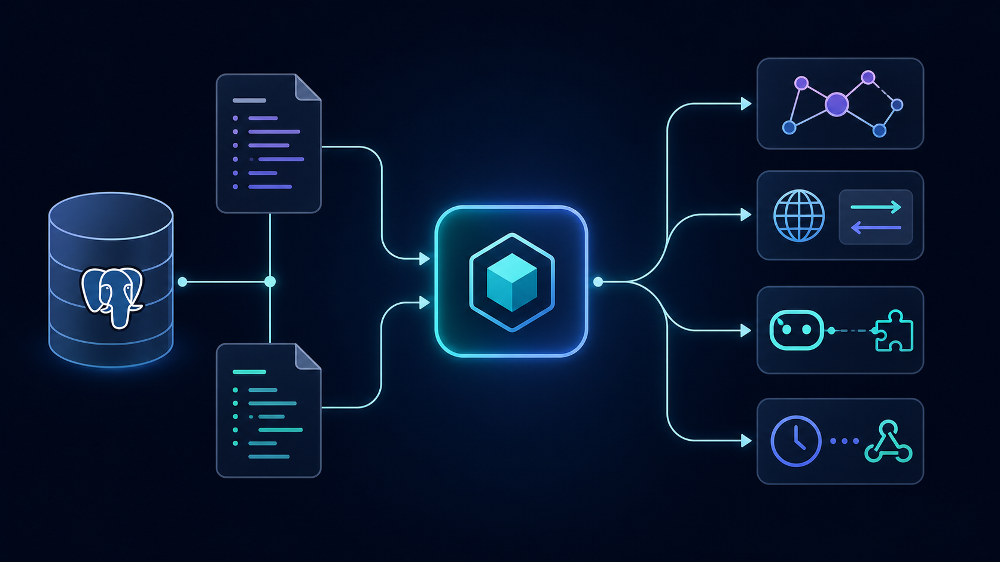
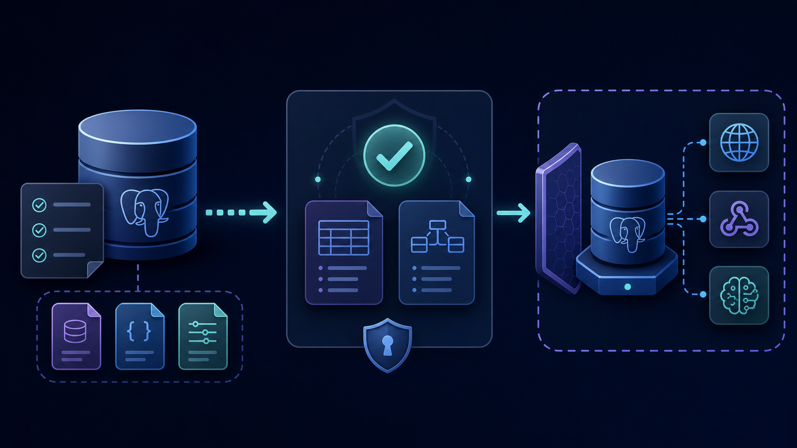

<div align="center">

# donat

## The permissioned data plane for PostgreSQL.

**Turn migrations and declarative metadata into GraphQL, REST, MCP, and
automation—without rebuilding access control for every interface.**

[](https://github.com/donatlabs/donat/actions/workflows/ci.yml)
[](https://github.com/donatlabs/donat/releases)
[](LICENSE)

[Run the Petshop example](#get-started) · [See why teams choose Donat](#why-teams-choose-donat) · [Explore the architecture](#built-for-a-single-data-plane)

</div>

---

Your database is already the source of truth. Donat turns it into a
self-hosted data plane: APIs, permissions, and integrations stay connected to
the same schema and the same deploy-time configuration.

<p align="center">
  
</p>

## One model. Every surface.

| You define | Donat delivers |
|---|---|
| Tables, foreign keys, and versioned SQL migrations | A per-role GraphQL schema and database-native execution plan |
| Declarative roles, row filters, column permissions, and presets | The same data policy on every enabled API surface |
| Saved operations and REST routes | Purpose-built HTTP endpoints without a parallel authorization layer |
| Event triggers, cron jobs, and webhook actions | Automation connected to the same schema and session context |

That means your app clients, integrations, and AI tools do not each grow their
own version of CRUD, authentication, and access rules.

## Why teams choose Donat

| Keep policy close to the data | Open the interfaces you need |
|---|---|
| Define explicit roles, row filters, column access, presets, and inherited roles once. Every request is evaluated through that model. | Serve GraphQL, RESTified saved operations, and MCP tools from one engine. Disable any surface at deploy time with one configuration flag. |

| Protect production boundaries | Avoid the resolver treadmill |
|---|---|
| There is no permission-bypass role, runtime metadata API, or `run_sql` endpoint. Configuration lives in reviewed files and is applied at deploy time. | Donat plans permissions and response shape with the query, rather than asking every application resolver to rediscover the schema and policy. |

### The Donat approach

1. **Schema in version control.** You own the migrations and metadata.
2. **Explicit access, every time.** Data requests run as an explicit role with
   matching permissions—never as an administrator that can see everything.
3. **One execution path.** REST and MCP translate into the same GraphQL
   pipeline, so filters, error contracts, and policy do not drift by transport.
4. **Evidence over assertions.** Compatibility behavior starts from fixtures
   and is checked against live database services in CI.

## Get started

The [Petshop example](examples/petshop) is a complete small deployment:
versioned schema, YAML metadata, public and authenticated roles, GraphQL,
REST, MCP, and webhook-ready configuration.

```sh
docker build -t ghcr.io/donatlabs/donat:latest .
cd examples/petshop
docker compose up
```

Then try the surfaces:

- **GraphQL** — <http://localhost:8080/v1/graphql>
- **REST** — <http://localhost:8080/api/rest/>
- **MCP** — <http://localhost:8080/mcp>

For focused examples, see [REST-only Petshop](examples/petshop-rest) and
[MCP-only Petshop](examples/petshop-mcp).

### From source

```sh
make build
make test
make run
```

Run the full compatibility suite with `make conformance`; run
`make conformance-matrix` to include the preview backend contract matrix.

## Built for a single data plane

Donat resolves a request into a SQL-free intermediate representation before
the selected database backend generates the query. On the Postgres reference
backend, response JSON is assembled in the database: one SQL statement per
root operation, with permission predicates inside the plan.

### What is available today

| Surface | What it is for |
|---|---|
| **GraphQL** | Queries, mutations, subscriptions, Relay, aggregates, relationships, computed fields, JSONB, and PostGIS on the Postgres reference backend. |
| **REST** | Metadata-declared endpoints backed by saved GraphQL operations; path, query, and body values become operation variables. |
| **MCP** | Permission-aware Streamable HTTP tools for discovering tables and querying or mutating data. |
| **Events & actions** | Postgres event triggers, durable cron delivery, and synchronous typed webhook actions. |
| **Remote & multi-source schemas** | Role-scoped remote GraphQL schemas and composed metadata sources where capabilities allow it. |

All three request-facing surfaces are enabled by default. Restrict exposure at
deploy time, for example:

```sh
DONAT_GRAPHQL_ENABLED_APIS=graphql
```

The REST and MCP routes are then not registered. A mounted route still needs
an explicit role and a matching permission.

## Designed to be operated, not bypassed

Deploy Donat like application infrastructure, not like a privileged database
console:

<p align="center">
  
</p>

1. Apply versioned DDL with `donat migrate`.
2. Check metadata against the migrated database with `donat validate`.
3. Start `donat serve` behind your normal TLS, authentication, rate-limit, and
   observability edge.

The engine is one Rust binary. It does not expose runtime metadata mutation or
an admin data role. Webhook handlers should be idempotent: event and cron
delivery is at least once.

## Compatibility you can inspect

Donat is developed conformance-first against fixtures derived from the Donat
v2 surface. A behavior change starts with a failing fixture; the result must
then pass unit and snapshot tests plus the native harness against real
services.

- [The CI pipeline](https://github.com/donatlabs/donat/actions/workflows/ci.yml)
  runs unit and snapshot tests, full Postgres reference conformance, the
  backend contract matrix, live MySQL and ClickHouse paths, and `cargo audit`.
- Security fixtures cover SQL injection, IDOR, hidden columns, preset
  enforcement, and missing session variables.
- The [conformance crate](crates/conformance) is the executable source of
  truth for request and error behavior.

## Backend support

Postgres is the supported reference backend. SQLite, MySQL, and ClickHouse
are CI-tested preview targets with explicit capability boundaries—not labels
for drop-in Postgres equivalence.

| Backend | Status | Important limits |
|---|---|---|
| **Postgres + PostGIS** | Supported reference | Full feature set, including Relay, JSONB, geo, upsert, nested inserts, and subscriptions. |
| **SQLite** | Preview | No Relay, `DISTINCT ON`, upsert, or nested inserts; JSON is JSON1 rather than JSONB. |
| **MySQL 8.0.14+** | Preview | No Relay, `RETURNING`, upsert, `DISTINCT ON`, or nested inserts. |
| **ClickHouse** | Preview, read-only | No mutations, relationships, JSON operators, geo, or Relay. |

The [backend conformance matrix](.github/workflows/ci.yml) makes those limits
executable: every backend runs only the fixtures its declared capabilities
support.

## Is Donat a fit?

Choose Donat when you want a PostgreSQL-backed API layer with declarative data
policy, self-hosting, and deploy-time configuration—especially when the same
data must safely serve application clients, REST consumers, and AI tools.

Donat is not an ORM, hosted database platform, or a replacement for complex
domain workflows in application code. Keep migrations and metadata in review;
use actions and webhooks at the boundaries where application behavior belongs.

## Get involved

Star or watch the [repository](https://github.com/donatlabs/donat), report an
[issue](https://github.com/donatlabs/donat/issues), or start with the
[examples](examples/). Design decisions and ongoing work live in the
[knowledge base](knowledgebase/); fixture conventions are documented in the
[conformance harness](crates/conformance/PORTING.md).

## License

Licensed under the [Apache License, Version 2.0](LICENSE). Some conformance
fixtures are derived from a third-party Apache-2.0 test suite; its license and
attribution are retained in `crates/conformance/fixtures/LICENSE.hasura`.
