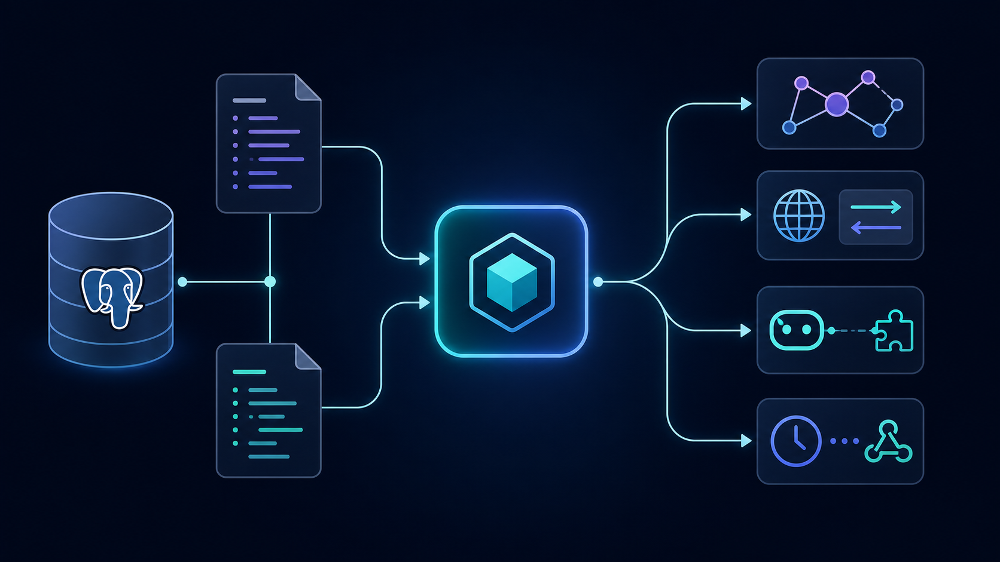
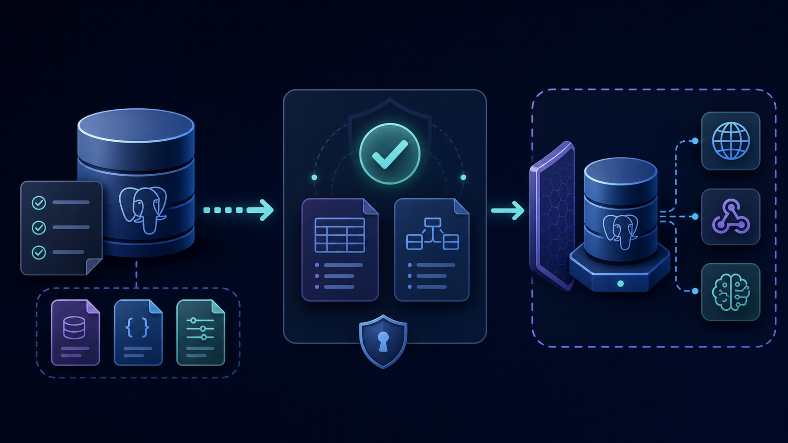

<div align="center">

# donat

## Declarative services on PostgreSQL.

**Write the system you drew on the whiteboard. The boxes, the arrows, the
retries, the "what if the payment provider times out" — as declarations, not
as glue code.**

[](https://github.com/donatlabs/donat/actions/workflows/ci.yml)
[](https://github.com/donatlabs/donat/releases)
[](LICENSE)

[Run the Petshop example](#get-started) · [See what you declare](#what-you-declare) · [Explore the architecture](#one-execution-path)

</div>

---

## The whiteboard is the source

In a system design interview you draw a checkout in two minutes. A box that
takes the order. An arrow to the payment provider. A note that says *retry with
backoff*. A second arrow for *what if it times out and we don't know whether it
charged*. A box that waits for the warehouse to confirm. A fan-out, one per
shipment.

Everyone in the room understands it. Then it becomes months of glue: outbox
tables, a job runner, correlation ids, an idempotency table, a reconciliation
script somebody runs by hand.

Donat is the bet that the drawing was already the specification.

```yaml
- id: request_authorization
  request:
    connector: mock_payment
    operation: authorize
    idempotency_key: { stable: { run: id, state: request_authorization } }
    retry:
      retry_on: [transport, timeout, http_429, http_5xx]
      max_attempts: 3
      initial_interval: 100ms
      jitter: deterministic_full
    next: route_authorization_response
    on_error:
      # A transport error does not prove the provider skipped the charge.
      fallback: { next: reconcile_authorization }
```

That is the arrow, the retry note, and the "what if it times out" branch. No
worker to write, no queue to run, no correlation id to invent.

## What you declare

| You draw | You declare | You do not write |
|---|---|---|
| A box that changes state | A **Command** — ordered steps in one transaction, with guards, batch writes and an idempotency key | Transaction plumbing, replay handling, a re-select after every write |
| A decision | A **Rule** or decision table — typed inputs, an expression or ordered rows, unit-testable in metadata | A tangle of `if` in three services that disagree |
| A long-running flow | A **Process** — states, waits, timers, signals, bounded fan-out, compensation, pinned revisions | An outbox, a scheduler, a status column that lies |
| An external system | A **Connector** — declared operations with request and response contracts, error classes, retry, rate limits, idempotency headers | A hand-rolled client per provider, and the reconciliation script |
| A file on a record | An **Attachment** — a uuid column declared beside the table's permissions, stored in S3 | An upload service, a second permission model, a cleanup cron |
| Who may see what | Per-role row filters, column sets and presets | An authorization layer per transport |

All of it is YAML in review, applied at deploy time. The engine is one Rust
binary that reads it and serves.

## Durable by construction

A Process is not a background job with a status column. Its journal lives in
the same database as your data, so a state transition and the rows it wrote
commit together or not at all.

- **Waits** park on a verified signal or a timer, for minutes or for a month.
  A signal committed before its wait became receptive is auditable, not lost.
- **Activities** hold a lease, retry on the classes you declared, and stop at
  the attempt limit.
- **Ambiguity is a first-class branch.** A timeout does not mean "it did not
  happen". Declare the read-only lookup that decides, and route on its answer.
- **Fan-out is bounded.** A per-item journal with a declared ceiling, so a
  hundred shipments cannot become an unbounded queue.
- **Revisions are pinned.** A running instance keeps the definition it started
  under; deploying a new one does not rewrite history mid-flight.

## It runs, not just parses

[`examples/petshop`](examples/petshop) is not a toy. It is a store with **11
durable Processes**, **73 Commands**, **60 rules and 10 decision tables** over
**41 declared types**, and **5 connectors**: checkout with tax and
authorization, cancellation racing an in-flight charge, partial fulfilment
with per-shipment capture, returns with three human approvals, subscription
dunning, B2B credit approval, marketplace payouts, prescription review and
payment reconciliation.

Every one is exercised end to end over HTTP against the real binary in
[`crates/conformance`](crates/conformance): a shopper calls the entry-point
Command, and the durable Process carries the order the rest of the way.

## Explicit access, no way around it

There is **no admin role**. Not "disabled by default" — the permission-bypass
role does not exist, and neither does a runtime metadata API or a `run_sql`
endpoint. Every data access resolves through an explicit per-role permission,
including the ones a Process makes on your behalf: a Process step runs as a
declared role, or as the caller whose session it captured.

Configuration is deploy-time. `donat migrate` applies DDL, a second `migrate`
deploys the Process revisions, and the serving engine runs neither.

## One execution path

A request resolves into a SQL-free intermediate representation before the
backend generates a query. On the Postgres reference backend the response JSON
is assembled in the database: one statement per root operation, permission
predicates inside the plan, no N+1.

REST and MCP are not parallel stacks — they translate into that same pipeline,
so filters, error contracts and policy cannot drift by transport.

<p align="center">
  
</p>

| Surface | What it is for |
|---|---|
| **GraphQL** | Queries, mutations, subscriptions, Relay, aggregates, relationships, computed fields, JSONB and PostGIS. |
| **REST** | Metadata-declared endpoints over saved operations; path, query and body become variables. |
| **MCP** | Permission-aware tools. A separate `mcp.yaml` publishes a small, role-scoped agent contract. |
| **Commands & Processes** | Transactional domain operations and durable flows, exposed as ordinary mutations. |
| **Events & actions** | Event triggers, durable cron delivery, verified inbound webhooks, typed synchronous actions. |
| **Files** | Presigned upload and download URLs for declared file columns on any S3-compatible store, public files served straight from a CDN, and orphaned objects collected in the background. No file byte passes through the engine. |

All request-facing surfaces are on by default; restrict them at deploy time
with `DONAT_GRAPHQL_ENABLED_APIS=graphql`. A mounted route still needs an
explicit role and a matching permission.

## Get started

```sh
docker build -t ghcr.io/donatlabs/donat:latest .
cd examples/petshop
docker compose up
```

That brings up Postgres, applies the schema, deploys the Process revisions,
answers the five declared providers with a local fixture, and serves:

- **GraphQL** — <http://localhost:8080/v1/graphql>
- **REST** — <http://localhost:8080/api/rest/>
- **MCP** — <http://localhost:8080/mcp>

For focused surfaces, see [REST-only](examples/petshop-rest) and
[MCP-only](examples/petshop-mcp).

### From source

```sh
make build
make test
make run
```

Run the compatibility suite with `make conformance`; add
`make conformance-matrix` for the preview backend contract matrix.

## Designed to be operated, not bypassed

<p align="center">
  
</p>

1. Apply versioned DDL with `donat migrate`.
2. Deploy Process revisions and check the metadata against the migrated
   database.
3. Start the engine behind your normal TLS, auth, rate-limit and observability
   edge.

Webhook handlers should be idempotent: event and cron delivery is at least
once. So is a Process activity — which is why an idempotency key is part of
the declaration rather than an afterthought.

## Evidence over assertions

A behaviour change starts from a failing fixture. The result must then pass
unit and snapshot tests plus the native harness against real services.

- [CI](https://github.com/donatlabs/donat/actions/workflows/ci.yml) runs the
  workspace against Postgres, full reference conformance, the backend contract
  matrix, live MySQL and ClickHouse paths, and `cargo audit`.
- Security fixtures cover SQL injection, IDOR, hidden columns, preset
  enforcement and missing session variables.
- The [conformance crate](crates/conformance) is the executable source of truth
  for request and error behaviour.
- Design decisions, including the ones that were wrong first, live as ADRs in
  the [knowledge base](knowledgebase/).

## Backend support

Postgres is the supported reference backend. SQLite, MySQL and ClickHouse are
CI-tested preview targets with explicit capability boundaries — not labels for
drop-in equivalence. Commands and Processes are Postgres-only.

| Backend | Status | Important limits |
|---|---|---|
| **Postgres + PostGIS** | Supported reference | Full feature set, including Relay, JSONB, geo, upsert, nested inserts and subscriptions. |
| **SQLite** | Preview | No Relay, `DISTINCT ON`, upsert or nested inserts; JSON is JSON1 rather than JSONB. |
| **MySQL 8.0.14+** | Preview | No Relay, `RETURNING`, upsert, `DISTINCT ON` or nested inserts. |
| **ClickHouse** | Preview, read-only | No mutations, relationships, JSON operators, geo or Relay. |

The [matrix](.github/workflows/ci.yml) makes those limits executable: each
backend runs only the fixtures its declared capabilities support.

## Is Donat a fit?

Choose Donat when the flow between your services is the hard part — when the
same data must serve app clients, REST consumers and AI tools, and when
"charged but not recorded" is a bug you cannot ship.

Donat is not an ORM, a hosted platform, or a place for genuinely computational
work. What it gives you is declarations with closed grammars: bounded,
reviewable, and refused at deploy time when they do not hold together. If your
logic wants a general-purpose language, keep it in a service and reach it
through a connector.

## Get involved

Star or watch the [repository](https://github.com/donatlabs/donat), report an
[issue](https://github.com/donatlabs/donat/issues), or start with the
[examples](examples/). Fixture conventions are documented in the
[conformance harness](crates/conformance/PORTING.md).

## License

Licensed under the [Apache License, Version 2.0](LICENSE). Some conformance
fixtures are derived from a third-party Apache-2.0 test suite; its license and
attribution are retained in `crates/conformance/fixtures/LICENSE.hasura`.
